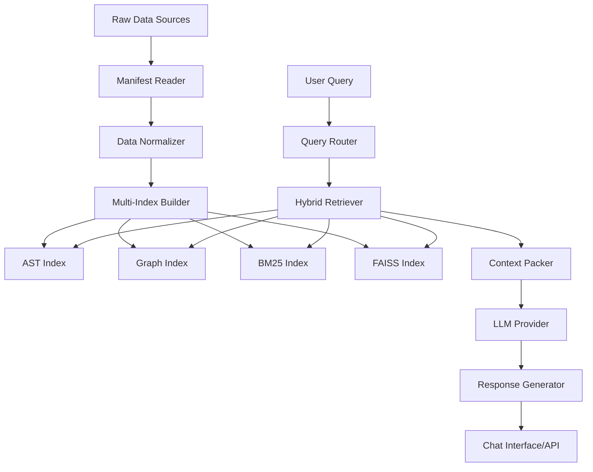

# 🏦 PIO-AI AML Database Engine - Complete Documentation

## 📋 Table of Contents

1. [System Overview](#-system-overview)
2. [Architecture & Components](#-architecture--components)
3. [Installation & Setup](#-installation--setup)
4. [Configuration](#-configuration)
5. [Script Execution Order](#-script-execution-order)
6. [Core Services](#-core-services)
7. [API Endpoints](#-api-endpoints)
8. [Advanced Features](#-advanced-features)
9. [Chat Interface](#-chat-interface)
10. [Troubleshooting](#-troubleshooting)
11. [Performance Optimization](#-performance-optimization)
12. [Development Workflow](#-development-workflow)

---

## 🎯 System Overview

The **PIO-AI AML Database Engine** is a production-grade AI-powered Retrieval-Augmented Generation (RAG) system specifically designed for Anti-Money Laundering (AML) database analysis and compliance monitoring. It combines multiple advanced indexing strategies, semantic search, and large language models to provide intelligent insights into complex financial data structures.

### 🏗️ Core Philosophy

- **Multi-Modal Intelligence**: Combines symbolic analysis (AST), graph relationships, full-text search (BM25), and semantic embeddings (BGE/FAISS)
- **Production-Ready**: Built for enterprise-scale AML compliance with robust error handling and monitoring
- **Extensible Architecture**: Modular design allows easy integration of new data sources and AI models
- **Compliance-First**: Designed with financial regulations and data privacy in mind

### 🔧 Key Capabilities

1. **Intelligent Code Analysis**: Deep understanding of Python codebases through AST parsing
2. **Relationship Mapping**: Graph-based analysis of database schema relationships
3. **Semantic Search**: BGE-large-en-v1.5 embeddings for contextual understanding
4. **Hybrid Retrieval**: Combines multiple search strategies for optimal results
5. **Interactive Chat**: Natural language interface for database exploration
6. **API-First Design**: RESTful APIs for system integration
7. **Real-time Analytics**: Live insights into AML data patterns

---

## 🏛️ Architecture & Components

### 📁 Project Structure

```
PIO-AI/
├── 📄 README.md                    # Main documentation
├── 📄 SYSTEM_RECAP.md             # Development history
├── 📄 README_DEV.md               # Developer guide
├── 🔧 config/                     # Configuration files
│   ├── app.yaml                   # Application settings
│   ├── database.yaml              # Database configuration
│   ├── chunking.yaml              # Document chunking settings
│   └── .env                       # Environment variables
├── 📦 warehouse/                   # Data storage
│   ├── manifest.yaml              # Project definitions
│   ├── catalog.db                 # Database metadata
│   ├── vectors/                   # Vector embeddings
│   └── db/oracle/                 # Oracle schema exports
├── 🗂️ indexes/                    # Search indexes
│   ├── symbols/                   # AST symbol tables
│   ├── graph/                     # Relationship graphs
│   ├── bm25/                      # Full-text indexes
│   ├── faiss_code/               # Code embeddings
│   └── faiss_text/               # Text embeddings
├── 🛠️ services/                   # Core business logic
│   ├── ingest/                    # Data ingestion
│   ├── indexer/                   # Index builders
│   ├── retriever/                 # Search orchestration
│   ├── llm/                       # Language model integration
│   ├── api/                       # REST API server
│   ├── tools_api/                 # Utility functions
│   └── db/                        # Database abstractions
├── 📜 scripts/                    # Automation scripts
│   ├── setup.py                  # Environment setup
│   ├── chat.py                   # Interactive CLI
│   ├── 0X_*.py                   # Processing pipeline
│   └── 4X_*.py                   # Advanced features
└── 🧪 tests/                      # Test suites
```

### 🔄 Data Flow Architecture



---

## 🚀 Installation & Setup

### Prerequisites

- **Python 3.9+** (Recommended: 3.11)
- **Git** for version control
- **Oracle Client** (for database connectivity)
- **GPU** (Optional, for faster embedding generation)

### 1. Initial Setup

```bash
# Clone the repository
git clone https://github.com/Pio-DataScience/PIO-AI.git
cd PIO-AI

# Run automated setup
python scripts/setup.py
```

The setup script will:
- ✅ Check Python version compatibility
- 📦 Install required dependencies
- 📁 Create directory structure
- 🔑 Configure environment variables
- 🧪 Test LLM provider connections

### 2. Manual Installation

```bash
# Create virtual environment
python -m venv .venv
.venv\Scripts\activate  # Windows
# source .venv/bin/activate  # Linux/Mac

# Install dependencies
pip install -r requirements.txt

# Additional packages for production
pip install sentence-transformers chromadb fastapi uvicorn
```

### 3. Oracle Database Setup

```bash
# Install Oracle client libraries
pip install cx_Oracle

# Configure TNS_ADMIN (if needed)
set TNS_ADMIN=C:\path\to\oracle\network\admin
```

---

## ⚙️ Configuration

### 🔧 Environment Variables (`.env`)

```bash
# LLM Provider Configuration
COHERE_API_KEY=your_cohere_api_key_here
OPENAI_API_KEY=your_openai_api_key_here
AZURE_OPENAI_API_KEY=your_azure_key_here
AZURE_OPENAI_ENDPOINT=https://your-resource.openai.azure.com

# Database Configuration
ORACLE_HOST=your_oracle_host
ORACLE_PORT=1521
ORACLE_SERVICE=your_service_name
ORACLE_USER=your_username
ORACLE_PASSWORD=your_password

# API Configuration
API_HOST=127.0.0.1
API_PORT=8008
DEBUG=false

# Performance Settings
MAX_WORKERS=4
CHUNK_SIZE=1000
EMBEDDING_BATCH_SIZE=32
```

### 📋 Application Settings (`config/app.yaml`)

```yaml
paths:
  root: "C:/Users/username/.vscode/WorkSpace/PIO-AI"
  warehouse: "C:/Users/username/.vscode/WorkSpace/PIO-AI/warehouse"
  indexes: "C:/Users/username/.vscode/WorkSpace/PIO-AI/indexes"
  logs: "C:/Users/username/.vscode/WorkSpace/PIO-AI/logs"

models:
  llm_provider: "cohere"           # Options: cohere, openai, azure_openai
  llm_model: "command-r-plus"      # Model specific to provider
  embedding_model: "BAAI/bge-large-en-v1.5"  # Embedding model

retrieval:
  top_k_bm25: 30                  # BM25 search results
  top_k_vec: 30                   # Vector search results
  mix_weight_vec: 0.55            # Vector weight in hybrid search
  mix_weight_bm25: 0.45           # BM25 weight in hybrid search
  expand_graph_hops: 1            # Graph traversal depth

security:
  strip_secrets: true             # Remove sensitive data
  obey_exclude_globs: true        # Respect exclude patterns
```

### 🗂️ Project Manifest (`warehouse/manifest.yaml`)

```yaml
projects:
  - name: AI_AML
    root_path: "C:\\path\\to\\your\\AML\\project"
    description: "Anti-Money Laundering detection system"
    include: ["**/*"]
    exclude: 
      - "**/.venv/**"
      - "**/__pycache__/**"
      - "**/.git/**"
      - "data/**"
      - "logs/**"
      - "models/**"
      - "*.parquet"
      - "*.csv"
  
  - name: Similarity
    root_path: "C:\\path\\to\\similarity\\project"
    description: "Customer similarity analysis"
    include: ["**/*"]
    exclude: ["**/.git/**", "**/.venv/**"]
```

---

## 🔄 Script Execution Order

### Phase 1: Validation & Setup

#### 00_validate_manifest.py
**Purpose**: Validates project configuration and paths
```bash
python scripts/00_validate_manifest.py
```
**What it does**:
- ✅ Verifies all project paths exist
- 📋 Validates manifest.yaml syntax
- 🔍 Checks include/exclude patterns
- 📊 Reports file counts per project

**When to run**: First step after configuration

---

### Phase 2: Data Ingestion

#### 10_ingest_dryrun.py
**Purpose**: Preview data ingestion without processing
```bash
python scripts/10_ingest_dryrun.py
```
**What it does**:
- 🔍 Scans all configured projects
- 📈 Reports file counts and types
- ⚠️ Identifies potential issues
- 📋 Shows what will be processed

**When to run**: Before building indexes to verify scope

---

### Phase 3: Index Building (Core Pipeline)

#### 21_build_ast_index.py
**Purpose**: Builds Abstract Syntax Tree (AST) symbol index
```bash
python scripts/21_build_ast_index.py <project_name>
python scripts/21_build_ast_index.py AI_AML --force
```
**What it does**:
- 🔍 Parses Python files using AST
- 📊 Extracts functions, classes, variables
- 💾 Creates SQLite symbol database
- 🔗 Maps line numbers to code structures

**Output**: `indexes/symbols/{project}.sqlite`
**Time**: ~2-5 minutes for large projects

#### 22_where_is_line.py
**Purpose**: Query tool for line-specific code lookup
```bash
python scripts/22_where_is_line.py --project AI_AML --path src/utils/monitor.py --line 42
```
**What it does**:
- 🎯 Finds function/class containing specific line
- 📍 Shows exact code context
- 🔍 Provides symbol information

**When to run**: After AST indexing for code navigation

#### 23_build_graph_index.py
**Purpose**: Builds call and import relationship graphs
```bash
python scripts/23_build_graph_index.py <project_name>
python scripts/23_build_graph_index.py AI_AML --verbose
```
**What it does**:
- 🕸️ Analyzes function calls and imports
- 🔗 Creates relationship graph database
- 📊 Maps code dependencies
- 🧭 Enables code navigation

**Output**: `indexes/graph/{project}.sqlite`
**Time**: ~3-8 minutes for large projects

---

### Phase 4: Search Index Building

#### 31_build_bm25.py
**Purpose**: Builds full-text search index using BM25 algorithm
```bash
python scripts/31_build_bm25.py <project_name>
python scripts/31_build_bm25.py AI_AML --rebuild
```
**What it does**:
- 📝 Indexes all text content using BM25
- 🔍 Enables fast keyword search
- 📊 Creates inverted index structure
- 🎯 Optimizes for exact term matching

**Output**: `indexes/bm25/{project}/`
**Time**: ~1-3 minutes for large projects

#### 32_build_faiss.py
**Purpose**: Builds vector embeddings using FAISS
```bash
python scripts/32_build_faiss.py <project_name>
python scripts/32_build_faiss.py AI_AML --embedding-model BAAI/bge-large-en-v1.5
```
**What it does**:
- 🧠 Generates embeddings using BGE model
- 🔍 Creates vector similarity index
- 📊 Separates code and text embeddings
- 🎯 Enables semantic search

**Output**: 
- `indexes/faiss_code/{project}/`
- `indexes/faiss_text/{project}/`
**Time**: ~5-15 minutes (depends on GPU)

---

### Phase 5: Advanced Features

#### 40_serve_api.py
**Purpose**: Starts the FastAPI REST server
```bash
python scripts/40_serve_api.py
# Or production mode:
python services/api/server.py
```
**What it does**:
- 🌐 Serves REST API on port 8008
- 🔍 Provides search endpoints
- 💬 Enables chat functionality
- 📊 Offers project management

**Endpoints**: http://localhost:8008/docs

#### 43_build_aml_relgraph.py
**Purpose**: Builds AML-specific relationship graphs
```bash
python scripts/43_build_aml_relgraph.py --rebuild --verbose
```
**What it does**:
- 🏦 Analyzes AML database relationships
- 🔗 Maps table foreign keys
- 📊 Creates compliance pathways
- 🎯 Optimizes for regulatory queries

**Output**: Enhanced graph indexes with AML metadata

#### 44_export_erd.py
**Purpose**: Exports Entity Relationship Diagrams
```bash
python scripts/44_export_erd.py --format graphml --output erd_diagram.xml
```
**What it does**:
- 📊 Generates visual database diagrams
- 🔗 Shows table relationships
- 📋 Exports in multiple formats
- 📈 Helps with documentation

---

### Phase 6: Chat & Production

#### chat.py
**Purpose**: Interactive command-line interface
```bash
python scripts/chat.py
python scripts/chat.py --project AI_AML --provider cohere
```
**What it does**:
- 💬 Provides interactive chat interface
- 🔍 Enables natural language queries
- 📊 Shows search results and citations
- 🎯 Supports project switching

#### Production Deployment

```bash
# Start production API server
python run_production_api.py

# Start web chat interface
python aml_web_chat.py

# Start command-line chat
python aml_chat.py
```

---

## 🛠️ Core Services

### 📥 Ingest Service (`services/ingest/`)

#### manifest_reader.py
**Purpose**: Reads and validates project configuration
```python
from services.ingest.manifest_reader import read_manifest, get_project_by_name

# Load all projects
manifest = read_manifest()
projects = manifest.get("projects", [])

# Get specific project
project = get_project_by_name("AI_AML")
```

#### normalizer.py
**Purpose**: Normalizes file paths and content
```python
from services.ingest.normalizer import normalize_path, detect_encoding

# Normalize paths for cross-platform compatibility
normalized = normalize_path("src\\utils\\monitor.py")
# Returns: "src/utils/monitor.py"

# Detect file encoding
encoding = detect_encoding("/path/to/file.py")
```

#### db_dict.py
**Purpose**: Database schema dictionary management
```python
from services.ingest.db_dict import load_schema_dict, get_table_info

# Load Oracle schema information
schema = load_schema_dict("oracle")
table_info = get_table_info("CUSTOMER_TRANSACTIONS")
```

### 🔍 Indexer Service (`services/indexer/`)

#### ast_index.py
**Purpose**: Builds Abstract Syntax Tree indexes
```python
from services.indexer.ast_index import ASTIndexer

indexer = ASTIndexer()
symbols = indexer.build_project_index(
    project_name="AI_AML",
    root_path="/path/to/project",
    includes=["**/*.py"],
    excludes=["**/test_*"]
)
```

#### graph_index.py
**Purpose**: Builds code relationship graphs
```python
from services.indexer.graph_index import GraphIndexer

indexer = GraphIndexer()
stats = indexer.build_project_graph(
    project_name="AI_AML",
    root_path="/path/to/project"
)
# Returns: {'files': 150, 'imports': 300, 'calls': 1200}
```

#### bm25_index.py
**Purpose**: Builds BM25 full-text search indexes
```python
from services.indexer.bm25_index import BM25Indexer

indexer = BM25Indexer()
indexer.build_project_index(
    project_name="AI_AML",
    items=document_list,
    out_dir="indexes/bm25/AI_AML"
)
```

#### faiss_index.py
**Purpose**: Builds FAISS vector embeddings
```python
from services.indexer.faiss_index import FAISSIndexer

indexer = FAISSIndexer()
stats = indexer.build_project_index(
    project_name="AI_AML",
    items=document_list,
    out_dir_code="indexes/faiss_code/AI_AML",
    out_dir_text="indexes/faiss_text/AI_AML"
)
```

### 🔎 Retriever Service (`services/retriever/`)

#### router.py
**Purpose**: Classifies queries and routes to appropriate search strategy
```python
from services.retriever.router import QueryRouter

router = QueryRouter()
query_type = router.classify_query("What does AML_REASON_COLS mean?")
# Returns: "schema", "code", "doc", or "line_code"
```

#### hybrid.py
**Purpose**: Orchestrates multiple search strategies
```python
from services.retriever.hybrid import HybridRetriever

retriever = HybridRetriever()
results = retriever.search(
    query="customer transaction monitoring",
    project="AI_AML",
    top_k=10
)
```

#### pack_context.py
**Purpose**: Assembles context for LLM from search results
```python
from services.retriever.pack_context import PackContext

packer = PackContext()
context = packer.pack_search_results(
    query="AML compliance",
    search_results=results,
    max_tokens=4000
)
```

#### query_enhancement.py
**Purpose**: Enhances queries for better search results
```python
from services.retriever.query_enhancement import QueryEnhancer

enhancer = QueryEnhancer()
enhanced = enhancer.enhance_query(
    query="suspicious transactions",
    context="AML monitoring"
)
```

#### rerank.py
**Purpose**: Reranks search results using advanced algorithms
```python
from services.retriever.rerank import Reranker

reranker = Reranker()
reranked = reranker.rerank_results(
    query="money laundering detection",
    results=initial_results,
    top_k=5
)
```

### 🤖 LLM Service (`services/llm/`)

#### provider.py
**Purpose**: Manages multiple LLM providers
```python
from services.llm.provider import get_available_providers, llm_manager

# Check available providers
providers = get_available_providers()
# Returns: ['cohere', 'openai', 'azure_openai']

# Use LLM
response = llm_manager.complete(
    prompt="Explain AML transaction monitoring",
    max_tokens=500
)
```

#### answer.py
**Purpose**: Generates comprehensive answers with citations
```python
from services.llm.answer import compose_answer

answer = compose_answer(
    query="What is suspicious activity monitoring?",
    context=search_context,
    citations=citation_list
)
```

#### prompt_templates.py
**Purpose**: Manages prompt templates for different use cases
```python
from services.llm.prompt_templates import (
    CODE_PROMPT, SCHEMA_PROMPT, DOC_PROMPT
)

# Use appropriate template based on query type
prompt = CODE_PROMPT.format(
    query="Find transaction validation logic",
    context=code_context
)
```

### 🌐 API Service (`services/api/`)

#### server.py
**Purpose**: FastAPI REST server with comprehensive endpoints
```python
# Production deployment
from services.api.server import app
import uvicorn

uvicorn.run(app, host="0.0.0.0", port=8008)
```

**Key Features**:
- 🔍 Semantic search endpoints
- 💬 Chat interface APIs
- 📊 Project management
- 🏦 AML-specific analytics
- 📈 Health monitoring
- 🔧 Configuration management

### 🛠️ Tools API (`services/tools_api/`)

#### fs_tools.py
**Purpose**: File system operations with project validation
```python
from services.tools_api.fs_tools import read_file

content = read_file(
    project="AI_AML",
    rel_posix="src/monitor.py",
    start=10,
    end=50
)
```

#### ast_tools.py
**Purpose**: AST-based code analysis tools
```python
from services.tools_api.ast_tools import where_is_line

location = where_is_line(
    project="AI_AML",
    rel_posix="src/utils/monitor.py",
    line=42
)
# Returns: Function/class info at that line
```

#### schema_tools.py
**Purpose**: Database schema analysis tools
```python
from services.tools_api.schema_tools import describe_table

table_info = describe_table("CUSTOMER_TRANSACTIONS")
# Returns: Columns, constraints, relationships
```

#### search_tools.py
**Purpose**: Search interface tools
```python
from services.tools_api.search_tools import grep

results = grep(
    project="AI_AML",
    query="AML_REASON_COLS",
    top_k=10
)
```

---

## 🌐 API Endpoints

### 🔍 Search Endpoints

#### POST /ask
**Purpose**: Main question-answering endpoint
```json
{
  "query": "What does AML_REASON_COLS mean?",
  "project": "AI_AML",
  "path": "optional/file/path.py",
  "line": 123
}
```

**Response**:
```json
{
  "answer": "AML_REASON_COLS is a configuration constant...",
  "citations": [
    {
      "file": "src/config.py",
      "lines": "15-20",
      "score": 0.95
    }
  ],
  "search_results": [...],
  "processing_time": 1.23
}
```

#### POST /search/semantic
**Purpose**: Semantic search using BGE embeddings
```json
{
  "query": "customer transaction monitoring",
  "max_results": 10,
  "similarity_threshold": 0.7
}
```

#### POST /search/hybrid
**Purpose**: Combined BM25 + vector search
```json
{
  "query": "suspicious activity detection",
  "project": "AI_AML",
  "search_types": ["bm25", "vector", "graph"],
  "weights": {
    "bm25": 0.4,
    "vector": 0.5,
    "graph": 0.1
  }
}
```

#### GET /search/suggestions
**Purpose**: Query auto-completion
```bash
GET /search/suggestions?q=transaction&project=AI_AML
```

### 💬 Chat Endpoints

#### POST /chat
**Purpose**: Interactive chat interface
```json
{
  "message": "Show me tables related to customer risk assessment",
  "session_id": "optional-session-id",
  "project": "AI_AML"
}
```

#### GET /chat/history/{session_id}
**Purpose**: Retrieve chat history
```bash
GET /chat/history/abc123
```

#### POST /chat/feedback
**Purpose**: Submit feedback on responses
```json
{
  "session_id": "abc123",
  "message_id": "msg456",
  "rating": 5,
  "feedback": "Very helpful explanation"
}
```

### 📊 Project Management

#### GET /projects
**Purpose**: List all configured projects
```json
[
  {
    "name": "AI_AML",
    "description": "Anti-Money Laundering system",
    "root_path": "/path/to/project",
    "indexes": {
      "symbols": true,
      "graph": true,
      "bm25": true,
      "faiss": true
    },
    "stats": {
      "files": 150,
      "lines": 25000
    }
  }
]
```

#### GET /projects/{project_name}
**Purpose**: Get detailed project information
```bash
GET /projects/AI_AML
```

#### POST /projects/{project_name}/rebuild
**Purpose**: Rebuild project indexes
```json
{
  "index_types": ["bm25", "faiss"],
  "force": true
}
```

### 🏦 AML-Specific Endpoints

#### GET /aml/tables
**Purpose**: List AML-related database tables
```json
[
  {
    "name": "CUSTOMER_TRANSACTIONS",
    "owner": "BI_DWH",
    "description": "Customer transaction records",
    "record_count": 1500000,
    "risk_level": "high"
  }
]
```

#### POST /aml/investigate
**Purpose**: AML investigation workflow
```json
{
  "customer_id": "CUST12345",
  "investigation_type": "suspicious_activity",
  "date_range": {
    "start": "2024-01-01",
    "end": "2024-12-31"
  }
}
```

#### GET /aml/compliance/report
**Purpose**: Compliance reporting
```bash
GET /aml/compliance/report?type=monthly&format=json
```

#### POST /aml/risk/assessment
**Purpose**: Risk assessment queries
```json
{
  "entity_type": "customer",
  "entity_id": "CUST12345",
  "assessment_criteria": [
    "transaction_volume",
    "geographic_risk",
    "business_type"
  ]
}
```

### 📈 Analytics Endpoints

#### GET /analytics/dashboard
**Purpose**: System analytics dashboard data
```json
{
  "search_stats": {
    "total_queries": 1500,
    "avg_response_time": 0.85,
    "satisfaction_score": 4.2
  },
  "index_stats": {
    "total_documents": 25000,
    "last_update": "2024-01-15T10:30:00Z"
  }
}
```

#### POST /analytics/query
**Purpose**: Custom analytics queries
```json
{
  "metric": "search_performance",
  "filters": {
    "project": "AI_AML",
    "date_range": "last_30_days"
  },
  "aggregation": "daily"
}
```

### 🔧 Configuration Endpoints

#### GET /config/providers
**Purpose**: List available LLM providers
```json
{
  "providers": [
    {
      "name": "cohere",
      "status": "available",
      "models": ["command-r-plus", "command-r"]
    },
    {
      "name": "openai",
      "status": "configured",
      "models": ["gpt-4", "gpt-3.5-turbo"]
    }
  ],
  "default": "cohere"
}
```

#### POST /config/provider
**Purpose**: Set default LLM provider
```json
{
  "provider": "openai",
  "model": "gpt-4"
}
```

#### GET /health
**Purpose**: System health check
```json
{
  "status": "healthy",
  "timestamp": "2024-01-15T10:30:00Z",
  "components": {
    "database": "healthy",
    "search_indexes": "healthy",
    "llm_provider": "healthy",
    "embeddings": "healthy"
  },
  "metrics": {
    "response_time": 0.45,
    "cpu_usage": 35.2,
    "memory_usage": 68.5
  }
}
```

---

## 🚀 Advanced Features

### 🧠 BGE Semantic Search

The system uses **BGE-large-en-v1.5** (Beijing Academy of AI) embeddings for state-of-the-art semantic understanding:

**Key Features**:
- 🎯 **1024-dimensional embeddings** for rich semantic representation
- 🏦 **Domain-specific tuning** for financial and AML terminology
- ⚡ **Fast inference** with GPU acceleration
- 🔍 **Contextual similarity** beyond keyword matching

**Implementation**:
```python
from sentence_transformers import SentenceTransformer

# Load BGE model
model = SentenceTransformer('BAAI/bge-large-en-v1.5')

# Generate embeddings
embeddings = model.encode([
    "suspicious transaction patterns",
    "anti money laundering compliance",
    "customer due diligence procedures"
])

# Similarity search
similarity = model.similarity(query_embedding, document_embeddings)
```

### 🕸️ Graph-Based Relationship Analysis

Advanced graph algorithms for understanding code and data relationships:

**Features**:
- 🔗 **Call graph analysis** for code dependencies
- 🏗️ **Schema relationship mapping** for database structures
- 🧭 **Path finding** between related entities
- 📊 **Centrality analysis** for identifying key components

**Example Usage**:
```python
from services.indexer.graph_index import GraphIndexer

# Find relationship paths
paths = graph.find_paths(
    source="CUSTOMER_TABLE",
    target="TRANSACTION_TABLE",
    max_hops=3
)

# Analyze code dependencies
dependencies = graph.get_dependencies(
    function="validate_transaction",
    depth=2
)
```

### 🔄 Hybrid Retrieval Strategy

Combines multiple search approaches for optimal results:

1. **BM25 (Keyword)**: Exact term matching with TF-IDF scoring
2. **Vector (Semantic)**: BGE embeddings for contextual understanding
3. **Graph (Structural)**: Relationship-based discovery
4. **Reranking**: Advanced scoring with cross-encoder models

**Configuration**:
```yaml
retrieval:
  strategies:
    - name: "bm25"
      weight: 0.35
      top_k: 30
    - name: "vector"
      weight: 0.45
      top_k: 30
    - name: "graph"
      weight: 0.20
      top_k: 20
  
  reranking:
    enabled: true
    model: "cross-encoder/ms-marco-MiniLM-L-6-v2"
    top_k: 10
```

### 🏦 AML-Specific Intelligence

Purpose-built features for Anti-Money Laundering compliance:

#### Regulatory Compliance
- 📋 **FATF Guidelines** compliance checking
- 🌍 **Jurisdiction-specific** rule validation
- 📊 **Audit trail** generation
- ⚠️ **Alert prioritization** based on risk scores

#### Transaction Pattern Analysis
- 🔍 **Anomaly detection** in transaction flows
- 📈 **Volume analysis** over time periods
- 🌐 **Cross-border** transaction monitoring
- 👥 **Entity relationship** mapping

#### Risk Assessment Integration
- 🎯 **Customer risk profiling** based on multiple factors
- 🏢 **Business type** risk categorization
- 🌍 **Geographic risk** assessment
- 💰 **Transaction amount** threshold monitoring

### 🔧 Production-Grade Features

#### Monitoring & Logging
```python
import logging
from services.monitoring import MetricsCollector

# Configure structured logging
logging.basicConfig(
    level=logging.INFO,
    format='%(asctime)s - %(name)s - %(levelname)s - %(message)s',
    handlers=[
        logging.FileHandler('logs/pio-ai.log'),
        logging.StreamHandler()
    ]
)

# Metrics collection
metrics = MetricsCollector()
metrics.track_query_performance(query_time=1.23, result_count=15)
```

#### Error Handling & Recovery
```python
from services.resilience import RetryHandler, CircuitBreaker

# Automatic retry for failed operations
@RetryHandler(max_attempts=3, backoff_factor=2)
def search_with_retry(query):
    return hybrid_search(query)

# Circuit breaker for external services
@CircuitBreaker(failure_threshold=5, recovery_timeout=60)
def llm_call_with_protection(prompt):
    return llm_provider.complete(prompt)
```

#### Caching Strategy
```python
from services.cache import CacheManager

cache = CacheManager(
    redis_url="redis://localhost:6379",
    default_ttl=3600  # 1 hour
)

# Cache search results
@cache.cached(key_prefix="search", ttl=1800)
def cached_search(query, project):
    return perform_search(query, project)
```

#### Security & Privacy
```python
from services.security import DataSanitizer, AccessControl

# Sanitize sensitive data
sanitizer = DataSanitizer()
clean_data = sanitizer.remove_pii(raw_content)

# Access control
@AccessControl.require_permission("read:aml_data")
def get_customer_data(customer_id):
    return fetch_customer_info(customer_id)
```

---

## 💬 Chat Interface

### 🖥️ Command-Line Chat (`aml_chat.py`)

Interactive terminal-based chat interface:

```bash
# Start command-line chat
python aml_chat.py

# Example interaction
🙋 You: What customer information is available in the database?

🤖 Assistant: Based on your question, I found these relevant database elements:

1. **BI_DWH.CUSTOMER_PROFILE** (Similarity: 89.2%)
   Contains comprehensive customer demographic and profile information including:
   - Customer ID, name, address details
   - Date of birth, nationality, occupation
   - Account opening date and customer type
   - Risk rating and KYC status

2. **BI_DWH.CUSTOMER_TRANSACTIONS** (Similarity: 85.7%)
   Stores all customer transaction records with:
   - Transaction amounts, dates, and types
   - Originating and beneficiary account details
   - Transaction channels and purposes
   - AML flags and monitoring status

For AML compliance, these tables work together to provide:
- Complete customer due diligence (CDD) information
- Transaction monitoring capabilities
- Risk assessment data points
- Regulatory reporting requirements
```

**Features**:
- 🔍 **Real-time semantic search** using BGE embeddings
- 📊 **Detailed similarity scores** and explanations
- 🎯 **AML-specific context** and recommendations
- 📝 **Conversation history** tracking
- 💡 **Example questions** and help system

### 🌐 Web Chat Interface (`aml_web_chat.py`)

Beautiful browser-based chat interface:

```bash
# Start web chat server
python aml_web_chat.py

# Access at: http://localhost:8009
```

**Features**:
- 🎨 **Modern, responsive design** with gradient backgrounds
- 💬 **Real-time messaging** with typing indicators
- 🔍 **Search result previews** with similarity scores
- 📱 **Mobile-friendly** interface
- 🎯 **Quick example buttons** for common queries
- 📊 **Visual feedback** with loading animations

**Example Web Interface**:
```html
<!-- Beautiful chat interface with -->
<div class="chat-container">
  <div class="chat-header">
    <h1>🏦 AML Database Chat</h1>
    <p>Ask questions about your AML database using BGE semantic search</p>
  </div>
  
  <div class="chat-messages">
    <!-- Messages appear here -->
  </div>
  
  <div class="chat-input">
    <input type="text" placeholder="Ask about the AML database...">
    <button>Send</button>
  </div>
</div>
```

### 🔌 API Chat Integration

RESTful API for custom chat interfaces:

```javascript
// JavaScript example for custom integration
async function sendChatMessage(message) {
  const response = await fetch('/chat', {
    method: 'POST',
    headers: {
      'Content-Type': 'application/json',
    },
    body: JSON.stringify({
      message: message,
      session_id: getCurrentSessionId(),
      max_results: 5
    })
  });
  
  const data = await response.json();
  return {
    response: data.response,
    searchResults: data.search_results,
    processingTime: data.processing_time
  };
}
```

### 💡 Example Chat Interactions

#### 1. Database Schema Exploration
```
User: "Show me all tables related to customer risk assessment"Assistant: Based on your query about customer risk assessment, I found these relevant tables:


Assistant: Based on your query about customer risk assessment, I found these relevant tables:

1. **BI_DWH.CUSTOMER_RISK_PROFILE** (Similarity: 92.8%)
   Primary table for customer risk assessment containing:
   - Risk scores by category (geographic, business, transaction)
   - Overall risk rating (LOW/MEDIUM/HIGH/CRITICAL)
   - Last assessment date and methodology version
   - Risk factors and mitigation measures

2. **BI_DWH.KYC_ASSESSMENT_RESULTS** (Similarity: 88.4%)
   Know Your Customer assessment outcomes including:
   - Customer due diligence (CDD) completion status
   - Enhanced due diligence (EDD) requirements
   - PEP (Politically Exposed Person) classifications
   - Source of wealth verification status

3. **BI_DWH.RISK_COUNTRY_MAPPING** (Similarity: 85.6%)
   Geographic risk assessment data:
   - Country risk ratings based on FATF guidelines
   - Sanctions list compliance status
   - Cross-border transaction risk factors
```

#### 2. Transaction Pattern Analysis
```
User: "How can I detect suspicious transaction patterns?"
